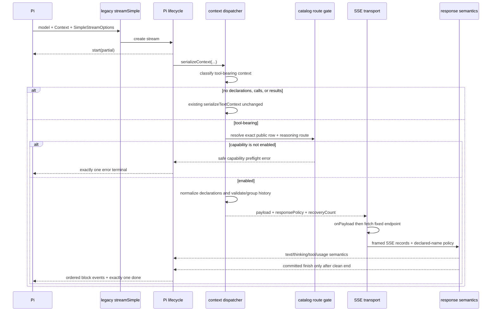
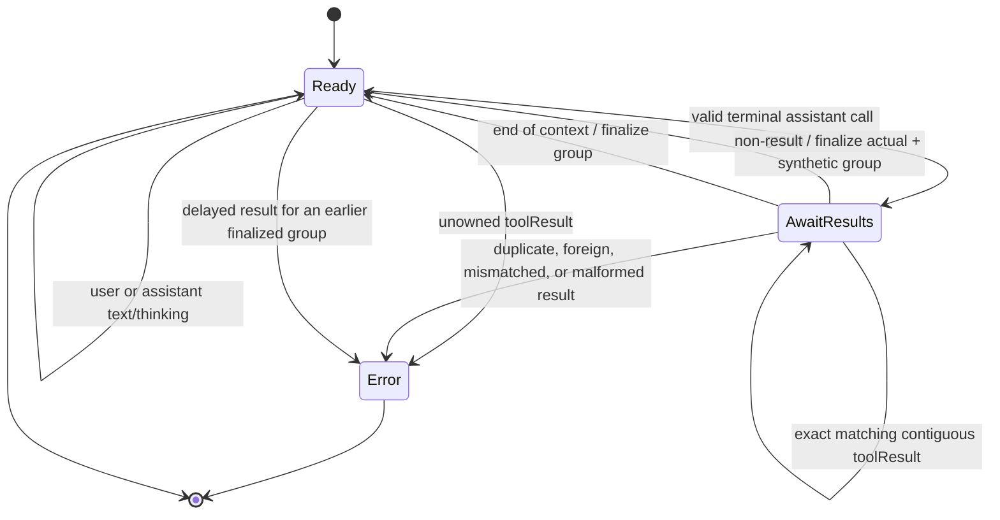
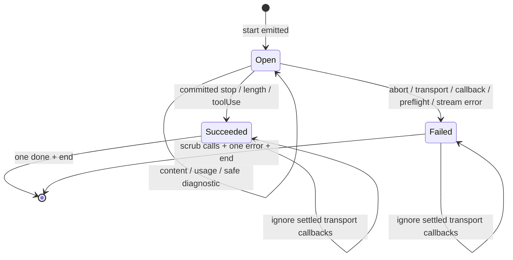

# Technical Design: Add Evidence-Gated Pi Tool Support

## Status and authority

This design implements the approved proposal and the canonical delta at `specs/pi-provider-adapter/spec.md`. It resolves implementation choices only; it does not broaden the product scope or authorize live model calls, credentials, publication, or a review-budget exception.

The implementation remains centered on `packages/pi`. Root OpenCode request transformation, auth, account storage, quota routing, recovery, fingerprints, and model behavior are compatibility-only and are not implementation targets.

No catalog route currently has tool-loop evidence in this change's artifacts. Therefore the safe implementation baseline is:

- all seven text models and all admitted reasoning routes remain registered for text in their existing order;
- every production route starts operationally tool-disabled;
- hermetic work may move an exact route to `fixture-qualified`, which still rejects ordinary tool-bearing requests;
- no route becomes `enabled` without a separately authorized, redacted direct evidence record for that exact route;
- both Claude rows remain operationally disabled until all additional continuity evidence required by the specification exists.

## Goals and non-goals

### Goals

1. Preserve the current no-tool serializer and stream behavior exactly.
2. Add a strictly typed Pi-local boundary for declarations, schema normalization, tool-call replay, tool-result replay, and orphan recovery.
3. Enforce row-and-route capability admission before transport.
4. Parse complete Antigravity function calls into the Pi 0.85.1 lifecycle without heuristic ID generation or partial executable calls.
5. Guarantee deterministic parallel-call grouping and exactly one terminal stream event.
6. Keep the legacy `registerProvider(name, config)` and `streamSimple` integration.
7. Keep the published Pi package self-contained and dependency-neutral beyond its existing runtime dependencies.

### Non-goals

There is no native `Provider` migration, OpenCode transformer reuse, durable tool/signature session store, Pi history mutation, image support, forced tool choice, dynamic model discovery, retry/fallback/rotation behavior, credential change, or root package behavior change.

## Architectural decisions

| Decision | Choice and rationale |
|---|---|
| Compatibility path | Keep `serializeTextContext()` as the exact no-tool fast path. A new dispatcher invokes the tool serializer only when declarations, assistant calls, or tool results are actually present. This minimizes regression risk and preserves existing object shape and field order. |
| Provider integration | Keep legacy `registerProvider("antigravity-guard", config)` and the current `streamSimple` ownership. No native-provider lifecycle surface is needed for context-derived recovery. |
| Tool capability | Store a capability value on every concrete catalog route, not at family or model level. Runtime admission requires effective state `enabled`; `disabled` and `fixture-qualified` both reject before `fetch`. |
| Evidence validity | Evidence is static, versioned catalog data. A contract revision or route identity mismatch resolves fail-closed to `disabled`; it never prevents text catalog registration. There is no runtime network discovery or date-based mutation. |
| Tool choice default | With nonempty declarations, omitted `toolChoice` means `AUTO`, matching ordinary Pi agent behavior. Explicit `auto` maps to `AUTO`; explicit `none` maps to `NONE`. With no current declarations, `auto` is rejected and `none` remains the existing no-op. |
| Constrained sampling | `constrainedSampling` may be absent or exactly `false`. Object-valued JSON-schema or grammar constraints are rejected because this change has no admitted semantics-preserving Antigravity mapping. They are never interpreted as forcing a call. |
| Schema policy | Implement a new immutable allowlist normalizer. Do not import `src/plugin/request.ts` or `request-helpers.ts`, and do not copy their lossy cleanup behavior. |
| Result matching | Match only exact call ID plus exact name. Reorder actual results to assistant source-call order and synthesize missing results at group finalization. Never generate IDs or use name/FIFO matching. |
| Response tool calls | Antigravity supplies a complete `functionCall` object in one parsed SSE record. Validate it atomically, canonicalize its argument object, then emit one complete Pi JSON delta. |
| Terminal commit | Delay the successful finish semantic until the SSE parser has validated `[DONE]` or clean EOF. This prevents a late invalid frame from following a prematurely emitted Pi `done`. |
| Failure cleanup | On any stream error, remove all tool-call blocks from the shared partial before the sole `error` event. A malformed stream cannot leave an executable call in final Pi state. |
| Recovery | Recovery is performed in request reconstruction, immediately beside the persisted assistant call group. It has no lock, cache, file, or session state. |
| Observability | Use safe typed errors and Pi's existing `AssistantMessage.diagnostics` field for tool-only capability/preflight/terminal/recovery categories. Never log or diagnose raw prompts, arguments, results, credentials, headers, projects, or upstream bodies. |

## Module and file boundaries

### Production modules

| Path | Responsibility |
|---|---|
| `packages/pi/src/catalog.ts` | Remains the sole source of public IDs, descriptors, routes, generation/replay/response policy, registration order, and now exact route tool capability. Adds a route-selection result containing the reasoning route key. |
| `packages/pi/src/tool-contract.ts` (new) | Pi-local JSON and wire discriminated unions, capability/evidence types, safe preflight error taxonomy, strict plain-data access helpers, and canonical JSON cloning/stringification. It imports Pi types only with `import type`. |
| `packages/pi/src/tool-schema.ts` (new) | Immutable schema allowlist normalizer and ordered declaration validation. It has no OpenCode imports, logging, environment, or package-global mutable state. |
| `packages/pi/src/tool-context.ts` (new) | Tool-bearing context classifier, declaration/tool-choice preparation, assistant-call validation, result grouping, exact result encoding, and context-derived orphan recovery state machine. |
| `packages/pi/src/context.ts` | Keeps `serializeTextContext()` behavior and exposes `serializeContext()` as the dispatcher. Builds the existing envelope plus tool-only fields from a prepared tool context. |
| `packages/pi/src/response.ts` | Adds strict function-call semantics, route/request response policy, source-call indexing, compatible `OTHER` handling, and delayed finish commit. |
| `packages/pi/src/stream.ts` | Uses `serializeContext()`, passes its response policy to `ResponseSemantics`, emits tool-call lifecycle events, records safe tool diagnostics, and enforces one-terminal cleanup. Transport/auth/header/timeout behavior remains unchanged. |
| `packages/pi/src/provider.ts` | Retains legacy registration and stream ownership. Only naming/import adjustments needed by the generalized serializer are allowed. |
| `packages/pi/package.json` | Update description only if documentation can truthfully distinguish text registration from gated tools. Add no runtime dependency for this design. |
| `packages/pi/README.md` | Add a route-level tool-status table, explicit preflight boundaries, supported choice/schema/result behavior, and the distinction between text registration and enabled tools. |
| `scripts/pack-consumer.ts` | Extend archive/load assertions to cover the new emitted runtime modules and retain production-only clean-consumer loading. |

`packages/core` and all root `src/` modules remain unchanged. If implementation discovers a need to touch them, that is a design deviation requiring a new scope review.

### Test and fixture boundaries

- Colocate unit tests as `tool-schema.test.ts`, `tool-context.test.ts`, and extensions to `catalog.test.ts`, `context.test.ts`, `response.test.ts`, `stream.test.ts`, and `provider.test.ts`.
- Store redacted exact wire fixtures under `packages/pi/fixtures/tools/`. The directory is outside `src`, excluded from TypeScript output, and omitted by the package `files` allowlist.
- Suggested fixtures are `declarations.json`, `parallel-replay.json`, `orphan-replay.json`, `single-call.sse`, `parallel-call.sse`, `interleaved-call.sse`, and malformed/terminal variants. Fixture content uses synthetic tool names and values only.
- A later authorized evidence lane writes a redacted `openspec/changes/add-pi-tool-support/evidence.md`; runtime code does not load OpenSpec files.

## Catalog capability representation and admission

Each concrete `GenerationRoute` receives an immutable capability value:

```ts
type ToolCapabilityState = "disabled" | "fixture-qualified" | "enabled"

type ToolCapability =
  | {
      readonly state: "disabled"
      readonly contractRevision: 1
      readonly reason:
        | "missing-fixture-evidence"
        | "missing-direct-evidence"
        | "stale-or-conflicting-evidence"
        | "claude-continuity-unproven"
    }
  | {
      readonly state: "fixture-qualified"
      readonly contractRevision: 1
      readonly fixtureEvidence: ToolEvidenceRef
    }
  | {
      readonly state: "enabled"
      readonly contractRevision: 1
      readonly fixtureEvidence: ToolEvidenceRef
      readonly directEvidence: ToolEvidenceRef
    }

interface ToolEvidenceRef {
  readonly record: string
  readonly revision: string
  readonly publicModelId: string
  readonly reasoning: StandardReasoningLevel
  readonly wireModel: string
}
```

A catalog helper constructs the effective capability from literal evidence. It compares contract revision, public model ID, reasoning key, and wire model with the containing route. Missing or mismatched evidence yields a frozen `disabled/stale-or-conflicting-evidence` value instead of throwing. Thus stale tool evidence cannot remove a text model at module load.

`resolveGenerationSelection(entry, reasoning)` returns:

```ts
interface GenerationSelection {
  readonly level: StandardReasoningLevel
  readonly route: GenerationRoute
  readonly tools: ToolCapability
}
```

The existing `resolveGenerationRoute()` remains as a compatibility wrapper. Provider, context, response policy, stream validation, docs tests, and diagnostics all consume the same selection. There is no family default and no fallback to another level.

Pi 0.85.1's legacy `ProviderModelConfig` has no tool-capability metadata field. To preserve the released Pi descriptor exactly, this design does not invent an unsupported field or change the descriptor name. Capability is exposed through the typed catalog, safe preflight diagnostics, and README route table. Text registration and tool enablement therefore remain separate without changing the seven Pi descriptors.

### Admission rules

- `enabled`: tool-bearing serialization and tool-call response parsing are allowed for this exact selection.
- `fixture-qualified`: return `PI_TOOL_CAPABILITY_NOT_ENABLED` before transport; include the public model, route, and state in safe metadata.
- `disabled`: return the same category with a reason-specific safe message.
- Tool-free context bypasses this gate and uses the existing serializer even when the route is disabled.
- Claude route literals stay `disabled/claude-continuity-unproven` unless an authorized evidence artifact proves declaration, call, result, thinking-signature, resume, interruption, and continuation behavior for that exact route.

## Typed Pi-local contracts

All externally supplied values are treated as `unknown` at runtime even when TypeScript calls them `Context`, `Tool`, or `ToolCall`. Validators accept only own data properties on plain objects and dense arrays. Getters, inherited fields, sparse arrays, symbol keys, cycles, non-finite numbers, `undefined`, functions, and class instances fail before transport. No `as any`, `@ts-ignore`, or `@ts-expect-error` is needed.

The local JSON contract is:

```ts
type JsonPrimitive = null | boolean | number | string
type JsonValue = JsonPrimitive | readonly JsonValue[] | JsonObject
interface JsonObject { readonly [key: string]: JsonValue }
```

The wire part contract is a discriminated union:

```ts
type WirePart =
  | { readonly text: string; readonly thought?: true; readonly thoughtSignature?: string }
  | { readonly functionCall: { readonly name: string; readonly args: JsonObject; readonly id: string }; readonly thoughtSignature?: string }
  | { readonly functionResponse: { readonly name: string; readonly id: string; readonly response: JsonObject } }
```

These types do not escape into the root OpenCode package.

### Determinism and resource bounds

- Canonical object keys use JavaScript UTF-16 lexical order with a documented comparator; array order is preserved.
- Normalized schema keyword insertion order is `type`, `description`, `nullable`, `enum`, `properties`, `required`, `items`.
- JSON object arguments use recursively sorted keys and preserved array order.
- Maximum schema depth is 32; maximum schema nodes are 2,048; maximum normalized schema size is 256 KiB per declaration and 1 MiB for all declarations.
- Maximum canonical argument depth is 64 and size is 1 MiB per call.
- System, user/assistant text, and tool-result text share the existing 8 MiB cumulative UTF-8 context limit.
- Exceeding a bound is a preflight error; content is never truncated.

The numeric bounds are implementation safety limits, not transformations, and are covered by boundary tests.

## Request preparation and data flow



The payload hook still may return `undefined` or an exactly JSON-equivalent payload only. Tool capability cannot be bypassed through `onPayload`.

## Tool declaration and schema normalization

### Declaration validation

Declarations remain in Pi order. For each tool:

1. Read own data fields only.
2. Require `name` to be nonempty, at most 64 characters, and match `^[A-Za-z_][A-Za-z0-9_.:-]*$` exactly. Preserve it verbatim; do not trim or sanitize.
3. Reject duplicate names.
4. Require a string description with `description.trim().length > 0`; preserve the original string verbatim.
5. Accept `constrainedSampling` only when absent or `false`; reject either object variant with `PI_TOOL_CONSTRAINED_SAMPLING_UNSUPPORTED`.
6. Normalize `parameters` under the declaration's name and path `$`.
7. Produce `{ name, description, parameters }` in that exact field order.

### Supported schema grammar

Every schema node must have exactly one `type` in:

- `object`
- `array`
- `string`
- `number`
- `integer`
- `boolean`

Allowed keywords are `type`, `description`, `properties`, `required`, `items`, `enum`, `nullable`, and input-only `const`. Unknown keywords fail at their exact path.

Rules by node:

- `description`, when present, is a string and is copied unchanged.
- `nullable`, when present, is a boolean and is copied unchanged.
- `enum` is a nonempty dense array of unique JSON scalar values compatible with the node's `type`; `null` is allowed only with `nullable: true`. Enum order is preserved.
- `const` must be one compatible JSON scalar, must not coexist with `enum`, and becomes a one-value `enum`.
- An `object` must contain a plain, nonempty `properties` object. Every property recursively satisfies this grammar. `required`, when present, is a dense array of unique property names that all exist in `properties`. Property names and the normalized `required` set are emitted in lexical order.
- An `array` must contain exactly one schema object in `items`; tuple-form `items` is rejected.
- Primitive nodes reject `properties`, `required`, and `items`; object nodes reject `items`; array nodes reject `properties` and `required`.
- Every object schema, including nested objects, must have nonempty properties. There is no placeholder or `additionalProperties` repair.

The normalizer walks into a fresh output tree, tracks visited objects to reject cycles, checks bounds, then deep-freezes the result. It never writes to input values.

### Explicit rejections

The implementation rejects `$ref`, `$defs`, `definitions`, `$schema`, `$id`, union types, `oneOf`, `anyOf`, `allOf`, `not`, `default`, `examples`, numeric/string/array constraints, `additionalProperties`, pattern properties, conditionals, dependencies, empty schemas, and every unknown keyword. It does not flatten, describe, or discard them.

Every failure carries the declaration name and a `$` path such as `$.properties.location.minLength`; values and descriptions are not included in the message.

## Tool choice and exact request fields

For an enabled route with declarations:

```json
{
  "tools": [
    {
      "functionDeclarations": [
        {
          "name": "read_file",
          "description": "Read one file",
          "parameters": {
            "type": "object",
            "properties": {
              "path": { "type": "string" }
            },
            "required": ["path"]
          }
        }
      ]
    }
  ],
  "toolConfig": {
    "functionCallingConfig": {
      "mode": "AUTO"
    }
  }
}
```

`none` differs only by exact mode `"NONE"`. Declarations are retained. Omitted choice with declarations is encoded as explicit `"AUTO"` so behavior does not depend on an upstream default.

Tool-only request field order is:

1. `contents`
2. optional `systemInstruction`
3. `tools`
4. `toolConfig`
5. `generationConfig`

The outer envelope remains `project`, `model`, `request`, `requestType`, `userAgent`, `requestId`. The no-tool fast path does not add empty `tools` or `toolConfig`, so current fixture shape and JSON field order remain unchanged.

A history-only tool context with no current declarations emits no `tools` or `toolConfig`. Omitted choice or `none` is accepted; `auto` fails because there is no callable declaration. Historical call names are validated for syntax and identity but are not required to remain in the current declaration list, which permits deterministic resume, compaction, and model handoff. Any new response call is still restricted to the current declared-name set and `AUTO` policy.

## Context validation, grouping, and orphan recovery

### Message state machine



The validator maintains request-local state only:

```ts
interface PendingCallGroup {
  readonly calls: readonly ValidatedCall[]       // assistant source order
  readonly resultsById: ReadonlyMap<string, ValidatedResult>
}
```

It also maintains `seenCallIds` and `seenResultIds` across the complete context. There are no module-global counters or maps.

### Assistant call-group rules

- A `toolCall` block requires a trim-nonempty ID, valid tool name, and canonical JSON object arguments.
- IDs are unique across the reconstructed context.
- A message containing calls must have `stopReason: "toolUse"`; an `error`, `aborted`, `pending`, text-stop, or length message containing calls is invalid incomplete history and does not trigger recovery.
- Text, thinking, and calls in one assistant message are serialized as model parts in their original block order.
- A call becomes pending only after the entire assistant message validates.
- Same-model signature replay applies independently to text, thinking, and tool-call `thoughtSignature`. Cross-model or strip-policy signatures are omitted without moving content.

Exact call wire encoding and field order are:

```json
{
  "functionCall": {
    "name": "read_file",
    "args": { "path": "README.md" },
    "id": "call-1"
  }
}
```

An admitted thought signature is a sibling after `functionCall`.

### Result association and ordering

Only contiguous `toolResult` messages after the call-bearing assistant message belong to that group. For each result:

1. Require a previously pending exact `toolCallId`.
2. Require exact `toolName` equality with that call.
3. Reject duplicate result IDs.
4. Reject every image item, including mixed content.
5. Accept text items only and preserve their Pi item order.
6. Ignore `details` and tool-execution `usage` because they are not model context.
7. Reject nonempty `addedToolNames` because native deferred tool loading is outside this provider contract.

When the group ends, emit one adjacent user content containing one `functionResponse` per source call. Iterate `calls`, never the result arrival map, so parallel completion order cannot affect wire order.

Actual result response objects are exact:

```json
{ "result": "first\n\nsecond" }
```

or:

```json
{ "error": "first\n\nsecond" }
```

No text items produce `{"result":""}` or `{"error":""}`. Empty text items remain present in the join; no trimming occurs.

The complete response part field order is:

```json
{
  "functionResponse": {
    "name": "read_file",
    "id": "call-1",
    "response": { "result": "..." }
  }
}
```

### Orphan recovery placement

At group finalization, every call without an actual result receives:

```json
{
  "error": {
    "code": "PI_TOOL_RESULT_MISSING",
    "message": "Tool execution did not complete or its result was not recorded. Treat the call as failed; do not assume it had no side effects and do not retry it automatically."
  }
}
```

The object is created with fixed insertion order `error`, then `code`, then `message`. Its containing `functionResponse` preserves the original call name and ID. Actual and synthetic parts are emitted together in call source order, immediately after the model call content and before the next unrelated message.

A later reconstructed context with a real contiguous result uses the real result because reconstruction begins from the supplied context each time. No synthetic result is persisted or cached.

If a result appears later after unrelated history, `seenCallIds` classifies it as a separated result and fails; it is not reassigned to the synthetic response or another call. Unknown IDs fail as foreign results.

### Parallel-call invariants

1. Every call in a context and response has one globally unique nonempty ID.
2. ID and name are preserved byte-for-byte after validation.
3. Result ownership is `(toolCallId, toolName)`, never name or position alone.
4. There is exactly one response part for each call: actual when present, otherwise synthetic.
5. Response part order equals assistant source-call order for every completion order.
6. A group produces exactly one adjacent user response content and cannot absorb a result across an unrelated message.
7. All maps, indexes, and recovery counts are request-local, so concurrent generations cannot affect one another.

## Response semantic contract

`ResponseSemantic` becomes:

```ts
type ResponseSemantic =
  | TextSemantic
  | ThinkingSemantic
  | ToolCallSemantic
  | UsageSemantic
  | FinishSemantic
  | ToolRequestDiagnosticSemantic

interface ToolCallSemantic {
  readonly type: "toolCall"
  readonly callIndex: number
  readonly id: string
  readonly name: string
  readonly arguments: JsonObject
  readonly argumentsJson: string
  readonly signature?: string
}

interface FinishSemantic {
  readonly type: "finish"
  readonly reason: "stop" | "length" | "toolUse"
}
```

`ResponseSemantics` is constructed with a request-derived policy:

```ts
type ToolResponsePolicy =
  | { readonly kind: "reject" }
  | { readonly kind: "accept"; readonly declaredNames: ReadonlySet<string> }
```

The policy is `accept` only when the exact route is enabled, current declarations are nonempty, and selection mode is `AUTO`. `NONE`, no declarations, no-tool requests, disabled routes, and fixture-qualified routes use `reject`.

### Atomic function-call validation

For each function-call part:

- the part may contain only `functionCall` and optional `thoughtSignature`;
- `functionCall` may contain only `id`, `name`, and `args`;
- ID must be trim-nonempty and unique across the response;
- name must exactly match one current declaration;
- args must be a strict JSON object, not null, scalar, array, stringified JSON, or a value containing unsafe/non-JSON data;
- arguments are cloned with sorted object keys, frozen, and serialized once to `argumentsJson`;
- optional valid base64 thought signature is retained under existing replay rules; malformed signatures retain existing strip behavior.

A record is validated transactionally before its semantics are returned. An invalid later part in the same record prevents delivery of all semantics from that record.

### Finish matrix

| Parsed content | Finish reason | Outcome |
|---|---|---|
| No calls | `STOP` | `finish/stop` |
| No calls | `MAX_TOKENS` | `finish/length` |
| One or more valid calls | `OTHER` | `finish/toolUse` |
| No valid call | `OTHER` | response error |
| Any call | `STOP` or `MAX_TOKENS` | incompatible-terminal response error |
| Calls rejected by response policy | any | response error |
| Any content | unknown reason | response error |

Text and thinking may coexist with calls before `OTHER`; their source order is preserved.

The parser records a pending finish but does not return `FinishSemantic` from `push()`. `finish()` validates content, finish reason, optional `[DONE]`, and clean EOF, then returns the sole finish semantic. A non-`[DONE]` record after a finish, any record after `[DONE]`, truncation, or empty content fails before Pi success is committed.

`callIndex` is the zero-based ordinal among function calls in upstream source order and is used for duplicate/order assertions. Pi events use Pi's required `contentIndex`, the actual position of the tool-call block in `output.content`; this preserves correct indexing when text or thinking is interleaved. In a call-only parallel batch the values coincide.

## Pi tool-call lifecycle and terminal state

### Lifecycle for one accepted call

```text
start
  [ordered text/thinking block events]
  toolcall_start(contentIndex)
  toolcall_delta(contentIndex, canonical complete JSON)
  toolcall_end(contentIndex, exact ToolCall)
  [additional ordered blocks/calls]
  done(reason: "toolUse")
```

On `ToolCallSemantic`, the lifecycle:

1. closes an open text/thinking block;
2. appends `{ type: "toolCall", id, name, arguments: {} }` at the next content index;
3. emits `toolcall_start`;
4. assigns the already validated canonical argument object and optional thought signature;
5. emits exactly one `toolcall_delta` with `argumentsJson`, including `"{}"` for empty arguments;
6. emits `toolcall_end` with the exact block now present in shared partial state.

No partial-JSON parser is needed because Antigravity supplies a complete call object. A malformed call never reaches this lifecycle.

### Terminal state machine



`finalize()` is the only terminal writer and guards an `open | succeeded | failed` state. It performs these invariants atomically:

- success closes any open text/thinking block, sets final stop reason, appends a safe terminal diagnostic only for a tool-bearing request, emits one `done`, then ends the stream;
- failure aborts internal transport, removes every `toolCall` from shared partial content, sets `error` or `aborted`, attaches only safe error text/diagnostics, emits one `error`, then ends the stream;
- every later semantic, promise resolution/rejection, abort callback, or transport callback is ignored;
- `done` and `error` are mutually exclusive and each can occur at most once.

Tool calls are never executed by this provider. Pi receives them only after `toolcall_end` and should act on the final `done/toolUse` message. Scrubbing the shared partial on error additionally prevents stale event references from presenting calls as executable state.

## Error taxonomy, redaction, and observability

### Preflight errors

`ToolPreflightError` has a stable `code`, category, safe model/route metadata, optional declaration name, and optional schema/history path.

| Category | Representative codes |
|---|---|
| `capability` | `PI_TOOL_CAPABILITY_NOT_ENABLED`, `PI_TOOL_EVIDENCE_STALE` |
| `tool-choice` | `PI_TOOL_CHOICE_UNSUPPORTED`, `PI_TOOL_CHOICE_WITHOUT_DECLARATIONS` |
| `declaration` | `PI_TOOL_DECLARATION_INVALID`, `PI_TOOL_DECLARATION_DUPLICATE`, `PI_TOOL_CONSTRAINED_SAMPLING_UNSUPPORTED` |
| `schema` | `PI_TOOL_SCHEMA_UNSUPPORTED`, `PI_TOOL_SCHEMA_INVALID`, `PI_TOOL_SCHEMA_LIMIT` |
| `history` | `PI_TOOL_CALL_INVALID`, `PI_TOOL_CALL_DUPLICATE`, `PI_TOOL_RESULT_FOREIGN`, `PI_TOOL_RESULT_DUPLICATE`, `PI_TOOL_RESULT_NAME_MISMATCH`, `PI_TOOL_RESULT_SEPARATED`, `PI_TOOL_HISTORY_INCOMPLETE` |
| `media` | `PI_TOOL_RESULT_MEDIA_UNSUPPORTED` |

Transport preserves these as trusted local errors and maps them to a `StreamTransportError` with kind `preflight` or `capability`; other thrown objects remain generic. Response call failures use kind `response` and a safe tool-stream category. HTTP access/model/quota behavior remains exactly as today and never triggers alternate routing.

### Redaction rules

Diagnostics and messages may contain only:

- stable error code/category;
- static public model ID;
- reasoning route key;
- capability state/reason;
- validated declaration/tool name;
- schema/history path or source index;
- HTTP status already admitted by current behavior;
- counts such as call count or synthetic recovery count.

They never contain tokens, API keys, credential JSON, project IDs, Authorization headers, raw prompts, schema descriptions, argument values/JSON, result text, response bodies, SSE records, or exception stacks from dependency boundaries.

### Pi diagnostics

For tool-bearing requests only, `AssistantMessage.diagnostics` receives safe entries such as:

```json
{
  "type": "antigravity-guard.tools",
  "details": {
    "publicModelId": "antigravity-gemini-3.8-flash",
    "reasoning": "low",
    "capabilityState": "enabled",
    "preflight": "accepted",
    "recoveryCount": 1,
    "terminal": "toolUse"
  }
}
```

Failures use the stable code/category and omit tool data. No diagnostic is added to successful no-tool messages, preserving their current semantic shape.

## Auth, quota, recovery, and persistence touchpoints

- OAuth login, refresh, credential form, stored project mapping, endpoints, headers, and request IDs are unchanged.
- Capability, schema, history, response, and tool failures do not retry, rotate accounts, change quota pools, substitute a model, or switch routes.
- Existing 429/`RESOURCE_EXHAUSTED` behavior remains a surfaced quota error only.
- New orphan recovery is exclusively in `packages/pi/src/tool-context.ts`; it does not call or import root `src/plugin/recovery.ts`.
- No persistence or locking is added. Same context plus same catalog selection always yields the same tool history bytes.
- Existing thinking replay policy remains catalog-controlled. No sentinel, signature cache, warmup turn, or Claude-specific repair is introduced.

## Test strategy and strict TDD

Every behavioral slice follows RED, GREEN, TRIANGULATE, REFACTOR. Tests that alter behavior land with that behavior.

### 1. Catalog and capability gate

- Assert exactly seven registrations and existing order/descriptors/routes.
- Assert every concrete reasoning route owns one frozen capability state.
- Assert no state is inherited across models, families, wire IDs, or reasoning levels.
- Assert stale/conflicting evidence resolves disabled without removing text registration.
- Assert `disabled` and `fixture-qualified` tool contexts fail before mocked `fetch`, while no-tool requests remain unchanged.
- Assert Claude routes remain operationally disabled with the continuity reason.

### 2. Schema and declaration fixtures

- Exact accepted nested schema output, sorted keys/required, declaration order, and `const` to enum.
- Deep input immutability and frozen output.
- Every rejected keyword/union/reference/empty schema, type mismatch, cycle, accessor, sparse array, symbol, non-finite number, and resource boundary.
- Valid/invalid/duplicate names, empty descriptions, and constrained-sampling rejection.
- Exact `AUTO` and `NONE`; omitted choice with declarations; unsupported runtime values; no-declaration behavior.

### 3. Context grouping and replay

- One and parallel calls, including same-name distinct IDs.
- Results supplied in reverse completion order but emitted in call source order.
- Exact success/error/multiple/empty text encodings and field order via `JSON.stringify` golden fixtures.
- Image and mixed-media rejection.
- Duplicate calls/results, mismatch, foreign result, delayed result, noncontiguous history, malformed assistant terminal, and nonempty `addedToolNames`.
- Partial parallel recovery and all-orphan recovery with exact required payload.
- Later real result superseding synthetic reconstruction.
- Resume/fork/compaction/model-handoff contexts yielding deterministic bytes.

### 4. Response semantics

- Single, parallel, and interleaved calls with declared-name policy.
- Exact canonical argument JSON and source-call index.
- Missing/blank/duplicate ID, unknown name, scalar/string args, extra fields, malformed JSON record, cycles impossible from JSON but hostile direct-unit values, and bounds.
- Finish matrix for `OTHER`, `STOP`, and `MAX_TOKENS`.
- Late frame after finish or `[DONE]`, missing finish, empty stream, usage placement, and transactional same-record failure.
- Existing text/thinking/signature/usage fixtures remain unchanged.

### 5. Pi lifecycle and transport

- Exact `start -> toolcall_start -> toolcall_delta -> toolcall_end -> done(toolUse)` event sequence and shared partial identity.
- Multiple calls have correct call ordinal and Pi content indexes; interleaved text/thinking order is exact.
- Empty argument object still emits one `"{}"` delta.
- Error after a previously emitted call scrubs calls and emits one error only.
- Abort before complete terminal call never fabricates or leaves a call.
- Concurrent streams remain isolated.
- Finish followed by late data cannot produce early success.
- Existing sync setup, callback, timeout, HTTP, malformed/empty SSE, body cancellation, and one-terminal regressions continue to pass.

### 6. Provider, docs, and distribution

- Legacy two-argument `registerProvider` remains the only registration call.
- Seven descriptor values and OAuth hooks remain unchanged.
- README status table is derived/asserted against catalog route states and never labels `fixture-qualified` as enabled.
- `npm run test:pack` verifies emitted new modules, no source/tests/fixtures in archive, no repository-relative runtime/declaration imports, clean production install, and extension loading with Pi 0.85.1 peers.

### Verification commands

Required hermetic verification is:

```text
npm test
npm run typecheck:pi
npm run build:pi
npm run typecheck
npm run build
npm run test:pack
```

Environment-backed E2E is not a substitute. Any direct tool-loop probe requires separate authorization, bounded exact-route scope, no fallback/retry, and redacted evidence recording.

## Compatibility guarantees

1. Tool-bearing classification is false only when `Context.tools` is absent/empty and no assistant call or tool-result message exists. That case invokes the existing serializer unchanged.
2. Existing no-tool request fixtures for every route and reasoning level remain exact in shape, values, and field order.
3. Text/thinking response behavior, signature stripping/replay, usage, cost, cancellation, headers, endpoint, OAuth, project mapping, and timeouts remain unchanged.
4. Static text registration remains exactly seven rows in the released order.
5. Tool-disabled and fixture-qualified routes reject only tool-bearing contexts.
6. Root OpenCode code and behavior remain unchanged and are protected by the root test/build checks.
7. New runtime code imports only Pi peers and existing published core APIs; no unpublished root source import is allowed.
8. The implementation adds no persistent format, lock, migration, global call counter, or provider-owned session state.

## Rollout and evidence gates

Rollout is a catalog-data transition, not a hidden environment flag:

1. Land the typed capability foundation with all routes disabled.
2. Complete the full hermetic fixture matrix for an exact row/route.
3. Record fixture evidence and optionally mark only that route `fixture-qualified`; runtime still rejects it.
4. Pause at the human-controlled direct-validation gate.
5. If authorized, run one bounded declaration -> call -> result -> continuation loop for the exact row/route, plus required parallel/interruption checks. Record only redacted evidence.
6. Mark that exact route `enabled` only when both evidence references match the current tool contract revision and route identity.
7. Update README capability status in the same change as activation.

No generic Gemini-shaped fixture enables another route. Claude additionally requires thought-signature, resume, and interruption continuity evidence and stays fail-closed otherwise.

## Review workload forecast and candidate slices

The complete implementation will materially exceed the 400 changed-line budget. No `size:exception` is granted and no chain strategy is selected here. Under `ask-on-risk`, the parent must pause before apply and ask the human to reduce scope, choose a chain strategy, or explicitly accept an exception.

Candidate reviewable work units, each targeting at most 400 changed lines including tests where feasible, are:

| Slice | Cohesive behavior | Likely files | Budget note |
|---|---|---|---|
| A | Route capability representation and fail-before-fetch admission | `catalog.ts`, `catalog.test.ts`, narrow `context/stream` gate tests | 250-350 lines |
| B | Canonical JSON and strict schema/declaration normalizer | new `tool-contract.ts`, `tool-schema.ts`, tests/fixtures | Near 400; split bounds/hostile cases if needed rather than omit them |
| C | Declaration/tool-choice wire request plus no-tool golden regressions | `context.ts`, first portion of `tool-context.ts`, context tests | 300-400 lines |
| D | Call/result grouping and deterministic parallel replay | `tool-context.ts`, grouping fixtures/tests | Near 400 |
| E | Orphan recovery and reconstructed-history failures | `tool-context.ts`, recovery fixtures/tests | 250-350 lines; may build on D |
| F | Strict function-call response semantics and terminal commit | `response.ts`, response fixtures/tests | 300-400 lines |
| G | Pi lifecycle tool events, call scrubbing, diagnostics, and transport integration | `stream.ts`, stream tests | Near 400 |
| H | Provider regression, README status, pack-consumer checks, final cross-slice integration | provider/docs/package/pack tests | 200-300 lines |

These are task-planning units, not an authorized PR chain. Tests stay with the behavior they protect. If any unit cannot remain under 400 without separating production code from its safety tests, the next phase must report the risk rather than create an untested slice.

## Rollback

### Route-level corrective rollback

Set the affected exact route capability to `disabled` and update README/evidence status in a corrective release. This immediately restores explicit preflight failure for tool-bearing contexts while preserving all text routes and no-tool behavior. Do not delete failed evidence records.

### Full pre-release rollback

Reverse dependencies in this order:

1. Disable every route.
2. Revert docs/package wording and provider integration assertions.
3. Revert lifecycle tool events and response function-call acceptance together, restoring strict function-call/`OTHER` rejection.
4. Revert tool-context serialization/replay/recovery and restore `executeStreamTransport()` to `serializeTextContext()`.
5. Remove schema/contract modules and catalog capability metadata last.

Request emission must never remain enabled after response parsing or replay has been removed. There is no persistent state to migrate or delete, and rollback must not alter credentials or Pi history.

## Resolved implementation questions

- Omitted tool choice with declarations is explicit `AUTO`.
- `none` is explicit `NONE` and retains declarations.
- Object-valued constrained sampling is rejected, not ignored or promoted to forced selection.
- Every object schema, including nested objects, requires nonempty properties.
- Schema object keys and required names are canonicalized; enum and result item order remain source order.
- Historical tools need not remain currently declared, but new response calls must be currently declared.
- Nonempty `addedToolNames` is rejected as deferred loading; result details and tool usage are ignored as non-context metadata.
- Assistant calls are recoverable only from a message terminally marked `toolUse`; aborted/error/pending call content is invalid and never synthesized.
- Successful Pi completion is committed only after clean parser termination.
- Pi `contentIndex` remains the real output block index; a separate `callIndex` records zero-based call order.
- No new runtime dependency, durable state, lock, retry, fallback, or feature flag is introduced.

No unresolved technical question blocks task planning. Capability activation and delivery strategy remain intentional human-control gates, not design gaps.
